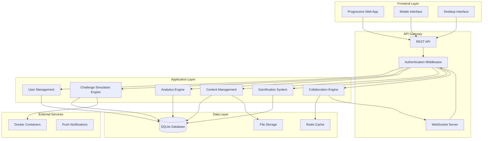

# Design Document

## Overview

SKJ Simulator Pro Enhancement akan mengembangkan aplikasi pembelajaran keamanan jaringan yang sudah ada menjadi platform yang lebih komprehensif dan interaktif. Design ini mempertahankan arsitektur dasar Flask + SQLite yang sudah ada sambil menambahkan fitur-fitur advanced seperti real-time collaboration, advanced simulation, user management, dan gamification.

## Architecture

### High-Level Architecture



### Technology Stack Enhancement

**Backend:**
- Flask 3.0+ (existing)
- Flask-SocketIO (for real-time features)
- Flask-JWT-Extended (for authentication)
- SQLAlchemy (ORM layer)
- Redis (for caching and real-time data)
- Celery (for background tasks)

**Frontend:**
- Vanilla JavaScript (existing, enhanced)
- Socket.IO client (for real-time features)
- Service Worker (for PWA functionality)
- Canvas API (enhanced for better simulations)

**Infrastructure:**
- Docker (for lab environments)
- Nginx (reverse proxy and static files)

## Components and Interfaces

### 1. Enhanced User Management System

#### User Model Extension
```python
class User:
    id: int
    name: str
    email: str
    password_hash: str
    role: str  # 'student', 'teacher', 'admin'
    class_id: int (optional)
    created_at: datetime
    last_active: datetime
    profile_picture: str (optional)
    preferences: JSON
```

#### Class Management
```python
class Class:
    id: int
    name: str
    teacher_id: int
    semester: int
    created_at: datetime
    is_active: bool
```

#### Authentication Flow
- JWT-based authentication
- Role-based access control (RBAC)
- Session management with Redis
- Password reset via email (future enhancement)

### 2. Advanced Challenge Simulation Engine

#### Challenge Model Extension
```python
class Challenge:
    id: str
    module_id: str
    title: str
    description: str
    difficulty: str  # 'beginner', 'intermediate', 'advanced'
    simulation_type: str  # 'network', 'terminal', 'visual', 'lab'
    simulation_config: JSON
    tasks: JSON
    hints: JSON
    solution: JSON
    points: int
    time_limit: int (optional)
    prerequisites: JSON
```

#### Simulation Types

**Network Simulation:**
- Interactive network topology
- Packet flow visualization
- Device configuration interface
- Real-time monitoring

**Terminal Simulation:**
- Web-based terminal emulator
- Command validation
- File system simulation
- Tool execution simulation

**Visual Simulation:**
- Canvas-based interactive diagrams
- Drag-and-drop interfaces
- Step-by-step guided tutorials
- Animation sequences

**Lab Environment:**
- Docker-based isolated environments
- Pre-configured vulnerable systems
- Safe exploitation practice
- Automated reset mechanisms

### 3. Real-time Collaboration System

#### WebSocket Architecture
```javascript
// Client-side WebSocket events
socket.on('challenge_update', (data) => {
    // Update challenge state for team members
});

socket.on('user_joined', (data) => {
    // Show team member joined
});

socket.on('leaderboard_update', (data) => {
    // Real-time leaderboard updates
});
```

#### Team Challenge Model
```python
class TeamChallenge:
    id: int
    challenge_id: str
    team_members: JSON  # list of user_ids
    status: str  # 'active', 'completed', 'expired'
    shared_state: JSON
    created_at: datetime
    completed_at: datetime (optional)
```

### 4. Analytics and Progress Tracking

#### Enhanced Progress Model
```python
class DetailedProgress:
    id: int
    user_id: int
    challenge_id: str
    session_id: str
    start_time: datetime
    end_time: datetime (optional)
    actions: JSON  # detailed user actions
    hints_used: int
    attempts: int
    final_score: int
    time_spent: int
    completion_rate: float
```

#### Analytics Dashboard Components
- Student performance metrics
- Challenge difficulty analysis
- Learning path recommendations
- Time-based progress tracking
- Comparative analysis

### 5. Content Management System

#### Content Model
```python
class Content:
    id: int
    type: str  # 'challenge', 'module', 'resource'
    title: str
    description: str
    content_data: JSON
    file_attachments: JSON
    version: int
    created_by: int
    created_at: datetime
    updated_at: datetime
    is_published: bool
```

#### Version Control System
- Content versioning
- Rollback capabilities
- Change tracking
- Approval workflow

### 6. Gamification System

#### Achievement Model
```python
class Achievement:
    id: int
    name: str
    description: str
    icon: str
    type: str  # 'challenge', 'streak', 'collaboration', 'milestone'
    criteria: JSON
    points: int
    rarity: str  # 'common', 'rare', 'epic', 'legendary'
```

#### User Achievement Tracking
```python
class UserAchievement:
    id: int
    user_id: int
    achievement_id: int
    earned_at: datetime
    progress: float  # for progressive achievements
```

#### Point System
- Base points per challenge completion
- Bonus points for speed
- Streak multipliers
- Collaboration bonuses
- Difficulty modifiers

## Data Models

### Enhanced Database Schema

```sql
-- Enhanced Users table
CREATE TABLE users (
    id INTEGER PRIMARY KEY AUTOINCREMENT,
    name TEXT NOT NULL,
    email TEXT UNIQUE,
    password_hash TEXT,
    role TEXT DEFAULT 'student',
    class_id INTEGER,
    profile_picture TEXT,
    preferences TEXT, -- JSON
    created_at TEXT NOT NULL,
    last_active TEXT,
    FOREIGN KEY (class_id) REFERENCES classes(id)
);

-- Classes table
CREATE TABLE classes (
    id INTEGER PRIMARY KEY AUTOINCREMENT,
    name TEXT NOT NULL,
    teacher_id INTEGER NOT NULL,
    semester INTEGER NOT NULL,
    created_at TEXT NOT NULL,
    is_active BOOLEAN DEFAULT TRUE,
    FOREIGN KEY (teacher_id) REFERENCES users(id)
);

-- Enhanced Challenges table
CREATE TABLE challenges (
    id TEXT PRIMARY KEY,
    module_id TEXT NOT NULL,
    title TEXT NOT NULL,
    description TEXT,
    difficulty TEXT DEFAULT 'beginner',
    simulation_type TEXT DEFAULT 'visual',
    simulation_config TEXT, -- JSON
    tasks_json TEXT NOT NULL,
    hints TEXT, -- JSON
    solution TEXT, -- JSON
    points INTEGER DEFAULT 50,
    time_limit INTEGER,
    prerequisites TEXT, -- JSON
    FOREIGN KEY (module_id) REFERENCES modules(id)
);

-- Detailed Progress table
CREATE TABLE detailed_progress (
    id INTEGER PRIMARY KEY AUTOINCREMENT,
    user_id INTEGER NOT NULL,
    challenge_id TEXT NOT NULL,
    session_id TEXT NOT NULL,
    start_time TEXT NOT NULL,
    end_time TEXT,
    actions TEXT, -- JSON
    hints_used INTEGER DEFAULT 0,
    attempts INTEGER DEFAULT 1,
    final_score INTEGER DEFAULT 0,
    time_spent INTEGER DEFAULT 0,
    completion_rate REAL DEFAULT 0.0,
    FOREIGN KEY (user_id) REFERENCES users(id),
    FOREIGN KEY (challenge_id) REFERENCES challenges(id)
);

-- Team Challenges table
CREATE TABLE team_challenges (
    id INTEGER PRIMARY KEY AUTOINCREMENT,
    challenge_id TEXT NOT NULL,
    team_members TEXT NOT NULL, -- JSON array
    status TEXT DEFAULT 'active',
    shared_state TEXT, -- JSON
    created_at TEXT NOT NULL,
    completed_at TEXT,
    FOREIGN KEY (challenge_id) REFERENCES challenges(id)
);

-- Achievements table
CREATE TABLE achievements (
    id INTEGER PRIMARY KEY AUTOINCREMENT,
    name TEXT NOT NULL,
    description TEXT NOT NULL,
    icon TEXT,
    type TEXT NOT NULL,
    criteria TEXT, -- JSON
    points INTEGER DEFAULT 0,
    rarity TEXT DEFAULT 'common'
);

-- User Achievements table
CREATE TABLE user_achievements (
    id INTEGER PRIMARY KEY AUTOINCREMENT,
    user_id INTEGER NOT NULL,
    achievement_id INTEGER NOT NULL,
    earned_at TEXT NOT NULL,
    progress REAL DEFAULT 1.0,
    UNIQUE(user_id, achievement_id),
    FOREIGN KEY (user_id) REFERENCES users(id),
    FOREIGN KEY (achievement_id) REFERENCES achievements(id)
);

-- Content Management table
CREATE TABLE content (
    id INTEGER PRIMARY KEY AUTOINCREMENT,
    type TEXT NOT NULL,
    title TEXT NOT NULL,
    description TEXT,
    content_data TEXT, -- JSON
    file_attachments TEXT, -- JSON
    version INTEGER DEFAULT 1,
    created_by INTEGER NOT NULL,
    created_at TEXT NOT NULL,
    updated_at TEXT NOT NULL,
    is_published BOOLEAN DEFAULT FALSE,
    FOREIGN KEY (created_by) REFERENCES users(id)
);
```

## Error Handling

### API Error Responses
```python
class APIError:
    error_code: str
    message: str
    details: dict (optional)
    timestamp: datetime
```

### Error Categories
1. **Authentication Errors** (401)
   - Invalid credentials
   - Expired tokens
   - Insufficient permissions

2. **Validation Errors** (400)
   - Invalid input data
   - Missing required fields
   - Format violations

3. **Resource Errors** (404)
   - Challenge not found
   - User not found
   - Content not available

4. **System Errors** (500)
   - Database connection issues
   - External service failures
   - Unexpected exceptions

### Error Recovery Strategies
- Automatic retry for transient failures
- Graceful degradation for non-critical features
- User-friendly error messages
- Detailed logging for debugging

## Testing Strategy

### Unit Testing
- Model validation tests
- API endpoint tests
- Business logic tests
- Utility function tests

### Integration Testing
- Database integration tests
- WebSocket communication tests
- Authentication flow tests
- File upload/download tests

### End-to-End Testing
- Complete user journey tests
- Challenge completion flows
- Real-time collaboration scenarios
- Mobile responsiveness tests

### Performance Testing
- Load testing for concurrent users
- Database query optimization
- WebSocket connection limits
- File storage performance

### Security Testing
- Authentication bypass attempts
- SQL injection prevention
- XSS protection validation
- File upload security

## Deployment Architecture

### Development Environment
- Local Flask development server
- SQLite database
- Hot reload for frontend changes

### Production Environment
- Nginx reverse proxy
- Gunicorn WSGI server
- Redis for caching and sessions
- Docker for lab environments
- SSL/TLS encryption

### Monitoring and Logging
- Application performance monitoring
- Error tracking and alerting
- User activity logging
- System resource monitoring

## Security Considerations

### Data Protection
- Password hashing with bcrypt
- JWT token security
- Input validation and sanitization
- SQL injection prevention

### Access Control
- Role-based permissions
- Resource-level authorization
- API rate limiting
- Session management

### Lab Environment Security
- Container isolation
- Network segmentation
- Resource limitations
- Automatic cleanup

This design provides a comprehensive foundation for enhancing the SKJ Simulator Pro application while maintaining compatibility with the existing codebase and ensuring scalability for future growth.